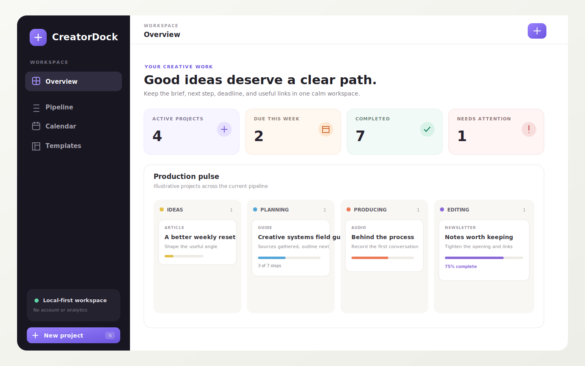

<p align="center">
  
</p>

<h1 align="center">CreatorDock</h1>

<p align="center"><strong>A calm, private workspace for taking creative projects from loose idea to published work.</strong></p>

<p align="center">
  <a href="https://github.com/RepoEnjoyer/CreatorDock/actions/workflows/ci.yml"></a>
  <a href="LICENSE"></a>
  
  
</p>

CreatorDock keeps briefs, hooks, deadlines, production checklists, reference links, and reusable workflows together without turning the creative process into a heavyweight project-management system. It runs entirely in the browser, stores work on the current device, and has no account, analytics, advertising, or application network client.



> The preview uses illustrative project names. A new CreatorDock workspace starts empty.

## Why CreatorDock?

Creative work often gets split across notes, bookmarks, calendars, and generic task boards. CreatorDock gives each project a useful brief and a clear production state, while staying quick enough to open every day.

- **Purpose-built project briefs:** Capture the hook, objective, audience, notes, tags, priority, and target date.
- **Visual production pipeline:** Move work through Idea, Planning, Producing, Editing, Scheduled, and Published.
- **Actionable checklists:** Start from a template, customize every step, and see progress at a glance.
- **Calendar view:** See target dates in a six-week month grid.
- **Reusable workflows:** Use five built-in templates or create and edit your own.
- **Reference links:** Keep sources and assets beside the project that needs them. Only `http` and `https` links are accepted.
- **Portable backups:** Export the full workspace as readable JSON and restore it after strict validation.
- **Offline-ready:** Installable as a lightweight web app after the first load.
- **Accessible controls:** Keyboard-friendly navigation, a skip link, visible focus states, and non-drag status controls.
- **Zero setup:** No database, environment variables, account, API key, or paid service.

## Quick start

Requirements: [Node.js](https://nodejs.org/) 20.19 or newer and npm.

```bash
git clone https://github.com/RepoEnjoyer/CreatorDock.git
cd CreatorDock
npm ci
npm run dev
```

Open the local address shown by Vite. Press <kbd>N</kbd> anywhere outside a form field to create a project.

For a production build:

```bash
npm run build
npm run preview
```

The static site is generated in `dist/`. It can be hosted on any static host. The relative asset base also supports subdirectory deployments.

## Everyday workflow

1. Create a blank project or start from a reusable template.
2. Write the working title and brief before production begins.
3. Add finishable checklist steps and useful reference links.
4. Move the project through the pipeline by dragging its card or using the status menu.
5. Use the calendar to spot crowded deadlines.
6. Export a backup from Settings at sensible intervals.

## Privacy and security model

CreatorDock is deliberately local-first:

- Workspace data is saved under one key in the browser's local storage.
- The application contains no fetch client, telemetry SDK, account system, cookies, or advertising code.
- External links open only after a user selects them and use `rel="noreferrer"`.
- Backup imports are limited to 2 MiB and validated field by field before replacing data.
- A strict Content Security Policy limits scripts, styles, connections, forms, frames, and objects.
- Publication-hygiene tests scan authored files for common home-directory paths, private-key blocks, and secret assignments.

This design does not encrypt browser storage. Anyone who can access the same browser profile may be able to read workspace data. Use a protected device profile and export backups to a location you trust. See [PRIVACY.md](PRIVACY.md) and [SECURITY.md](SECURITY.md) for the full boundaries.

## Data and configuration

CreatorDock has no environment variables or runtime configuration file. Appearance and user-created data live in the current browser. A JSON backup contains:

- `format` and export timestamp metadata
- projects, including briefs, dates, tags, tasks, and resource links
- custom templates
- the selected theme

Importing a backup replaces the current workspace after confirmation. Built-in templates are restored from the installed application so a backup cannot silently redefine them.

## Commands

| Command | Purpose |
| --- | --- |
| `npm run dev` | Start the development server |
| `npm run typecheck` | Run strict TypeScript checks |
| `npm run lint` | Check source and configuration files |
| `npm test` | Run the Vitest suite once |
| `npm run build` | Type-check and create a production build |
| `npm run check` | Run lint, types, tests, and build together |

## Troubleshooting

**Changes are not persisting**

Check whether the browser blocks local storage in the current profile or private-browsing mode. CreatorDock shows a storage warning when a save fails. Export a backup before closing the tab if possible.

**The app is blank after an update**

Reload once while online so the service worker can refresh the application shell. If needed, clear this site's cached files, but export workspace data first. Clearing all site data also deletes local storage.

**A backup will not import**

Confirm that it is valid JSON, smaller than 2 MiB, and was exported by a compatible CreatorDock version. The displayed validation error identifies the rejected area.

**A resource link is rejected**

CreatorDock accepts complete `http://` and `https://` URLs only. Other protocols are blocked.

## Project documentation

- [Privacy model](PRIVACY.md)
- [Security policy](SECURITY.md)
- [Contribution guide](CONTRIBUTING.md)
- [Roadmap](ROADMAP.md)
- [Changelog](CHANGELOG.md)
- [Architecture handoff](AI_HANDOFF.md)

## Contributing

Thoughtful bug reports, focused feature proposals, accessibility improvements, and well-tested pull requests are welcome. Read [CONTRIBUTING.md](CONTRIBUTING.md) before starting substantial work.

## License

CreatorDock is available under the [MIT License](LICENSE). Copyright (c) RepoEnjoyer.
